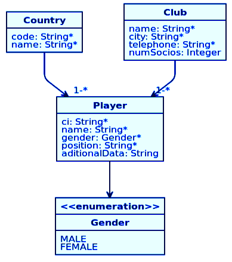

# Proyecto TareaSoapPlayer

Autor: Navarro Arias, Luis Fernando Numa.  
Modulo: Consumo de APIs.  
Universidad Andina Simón Bolivar.  
Sede Sucre, Bolivia.  

## Descripción.
Proyecto que ofrece servicios SOAP que utiliza la misma base de datos que el proyecto [SOAP](https://github.com/lfnna1977/TareaSoapPlayer.git)

## Base de datos.

El archivo *player.sql* contiene la base de datos para Mysql.

## Herramientas utilizadas.
Sistema operativo: Debian 10 con Gnome  
IDE: Eclipse v.4.12.0  
Cliente SOAP: [SoapUI](https://www.soapui.org/) v.5.5.0   
Navegador web: Firefox 60.8.0esr  
Framework: Spring Boot con JAXB2 para el mapeo de clases del archivo XML (esquema XSD) que contiene las operaciones CRUD disponibles.  

## Para consumir los servicios de SOAP.

Los servicios se consumen con el programa SoapUI, se implementó los servicios para la tabla **CLUB**, se cuenta los siguientes servicios:

* addClub
* deleteClub
* getAllClubs
* getClubById
* UpdateClub

Para consumir se utiliza la siguiente URL: [http://uasb-api.rootcode.com.bo:8077/soapws/clubs.wsdl]

En SoapUI, ir a "File", "New Soap Proyect". 
En la ventana que aparece, escribir la dirección proporcionada en: “Initial WSDL”. 
Dejar seleccionada la opción: “Create sample requests for all operations” para que se cree las operaciones disponibles.

## Comandos de maven.

### Para importar en Eclipse.
mvn clean eclipse:eclipse  

### Para correr el proyecto.
mvn spring-boot:run  

### Para crear el jar ejecutable.
mvn clean package  

## Fuentes.
[https://spring.io/projects/spring-boot](https://spring.io/projects/spring-boot)  
[https://www.concretepage.com/spring-boot/spring-boot-soap-web-service-example](https://spring.io/projects/spring-boot)